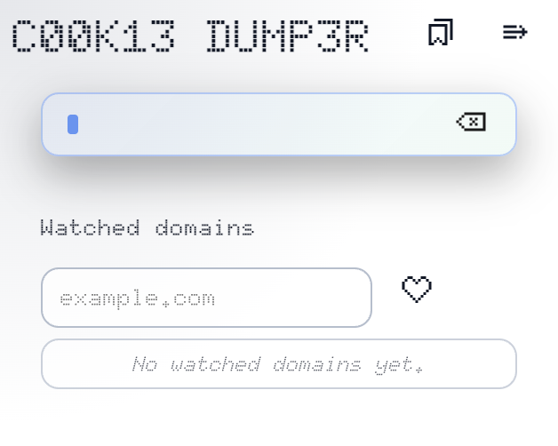

```
███████████████████████████████████████████████████

    ██████  ██████   ██████  ██   ██  ██ ██████
   ██      ██  ████ ██  ████ ██  ██  ███      ██
   ██      ██ ██ ██ ██ ██ ██ █████    ██  █████
   ██      ████  ██ ████  ██ ██  ██   ██      ██
    ██████  ██████   ██████  ██   ██  ██ ██████

██████  ██    ██ ███    ███ ██████  ██████  ██████
██   ██ ██    ██ ████  ████ ██   ██      ██ ██   ██
██   ██ ██    ██ ██ ████ ██ ██████   █████  ██████
██   ██ ██    ██ ██  ██  ██ ██           ██ ██   ██
██████   ██████  ██      ██ ██      ██████  ██   ██

███████████████████████████████████████████████████
```

[Read this in English 🇬🇧​](README_en.md)

Extensiones y utilidades para exportar cookies de los dominios que elijas. La extension permite volcar las cookies a disco o enviarlas por HTTP; el servidor opcional en `server/` recibe esos payloads y los guarda.

> ### DISCLAIMER
>
> **Uso responsable:** Este proyecto es solo para fines educativos y de investigacion defensiva. No lo uses para acceder a sistemas o cuentas sin autorizacion expresa.
>
> **No está autorizado su uso, copia, modificación ni distribución sin permiso expreso del autor.**

## Que incluye

- Extension de Chrome/Chromium (MV3) con popup tipo SPA para gestionar dominios vigilados, auto-dump y envio manual.
- Modo File (descarga JSON) o HTTP (POST al endpoint que definas).
- Doble cifrado de los payloads antes de serializar.
- Servidor minimo en Flask para recibir `/api/cookie` o `/api/cookie-header` y guardar resultados en `server/cookies/`.
- Documentacion visual en `extension/docs/index.html` (ES) y `extension/docs/index-en.html` (EN).

<div style="display: flex; align-items:center; justify-content:center; gap:1rem;">
    
    
</div>

## Estructura del repo

- `extension/`: codigo de la extension (popup, service worker, assets e iconos).
- `extension/docs/`: guias y capturas rapidas de la UI.
- `server/`: receptor HTTP opcional. Lee `server/README.md` para detalles completos.

## Requisitos

- Chrome o Chromium con modo desarrollador para cargar extensiones desempaquetadas.
- Opcional para el servidor: Python 3.10+ y `pip`.

## Instalar la extension desde el codigo

1. Clona el repo y abre la carpeta:
   ```bash
   git clone https://github.com/N0M4D-D3V/cookie-dumper.git
   cd cookie-dumper
   ```
2. Abre `chrome://extensions/`, activa _Developer mode_.
3. Pulsa _Load unpacked_ y selecciona la carpeta `extension/` del repo.
4. Fija el icono de Cookie Dumper en la barra para tenerlo a mano.

## Uso rapido

- Agrega dominios vigilados desde la vista principal; puedes tomar el hostname de la pestaña activa con el boton de bookmark.
- En **Advanced** elige modo `File` o `HTTP` y guarda el endpoint si usas HTTP.
- `AUTO-DUMP` escucha navegacion en background y dispara el volcado si el dominio coincide.
- Acciones manuales: `DUMP TAB` (pestaña activa) o `DUMP ALL` (todos los dominios guardados).
- En modo File, Chrome descargara el JSON dentro de tu carpeta de descargas. En modo HTTP enviara el payload en un solo POST.

## Servidor receptor opcional

Si quieres recibir los dumps por HTTP en local:

```bash
cd server
python -m venv venv
source venv/bin/activate        # en Windows: venv\\Scripts\\activate
pip install flask flask-cors
python main.py --port 5000
```

- Endpoints: `http://localhost:5000/api/cookie` (estructura original) o `/api/cookie-header` (cabeceras HTTP). Configura uno de ellos en la pantalla **Advanced** de la extension.
- Archivos generados en `server/cookies/`.
- Mas info en `server/README.md` y `server/README_en.md`.

## Documentacion de la UI

- Abre `extension/docs/index.html` (espanol) o `extension/docs/index-en.html` (ingles) en tu navegador para ver la guia ilustrada.

## Licencia

All rights reserved. Ver `LICENSE`.
